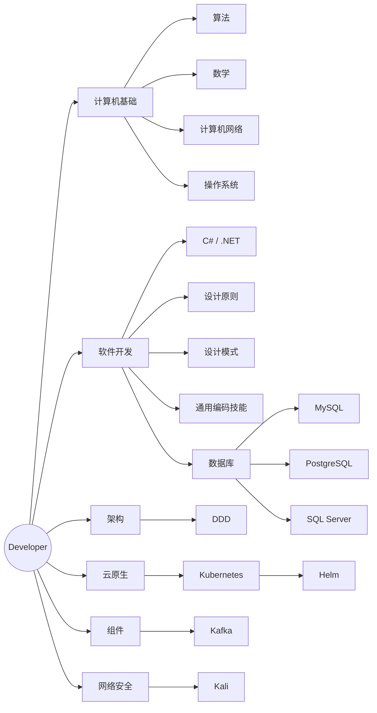

# <center>SkillTree</center>

## 开发者技能树



## 目录结构

```text
SkillTree/
+-- Algorithm/
|   +-- 图与网络/
|       +-- 旅行商问题TSP.md
|       +-- 非对称旅行商问题ATSP.md
+-- Architecture/
|   +-- DDD.md
+-- Component/
|   +-- Helm Chart.md
|   +-- kafka配置外部地址.md
+-- Cybersecurity/
|   +-- Lab/
|   |   +-- Kali/
|   |   |   +-- Dockerfile
|   |   |   +-- apt-install-retry
|   |   +-- Target/
|   |   |   +-- Dockerfile
|   |   +-- compose.yaml
|   |   +-- notice.md
|   +-- Tools/
|       +-- Kali.md
|       +-- msfconsole.md
+-- DataBase/
|   +-- MySql/
|   |   +-- MySQL.md
|   |   +-- LeetCode.sql
|   |   +-- 优化.sql
|   |   +-- 并行查询.sql
|   |   +-- 数据库慢查询.sql
|   |   +-- 评估数据体量&单表数据量过大处理方式.sql
|   +-- PostgreSQL/
|   |   +-- pssql.md
|   |   +-- pssql学习.txt
|   +-- SQL Server/
|   |   +-- SQL Server执行计划.md
|   |   +-- SQLServer.md
|   |   +-- 常用.sql
|   +-- CTE和View.md
+-- DesignPattern/
|   +-- 设计模式.md
+-- DesignPrinciples/
|   +-- SOLID.md
+-- DotNet/
|   +-- Examples/
|   |   +-- CSharpNetLts/
|   +-- Question/
|   |   +-- 多线程并发访问DbContext.md
|   |   +-- 多线程并发访问Hashset.md
|   +-- ChangeTracker.TrackGraph.md
|   +-- CSharp和NET-LTS中高阶指南.md
|   +-- DistinctBy性能.md
|   +-- ExecutionContext和SynchronizationContext.md
|   +-- EndpointFilter.md
|   +-- Interlocked.md
|   +-- NET10技术学习指南.md
|   +-- Roslyn.md
+-- GeneralCodingSkills/
|   +-- 正则表达式.md
+-- Mathematics/
|   +-- 生日悖论.md
+-- Network/
    +-- 网络模型.md  
+-- OperatingSystem/
|   +-- Linux/
|   +-- Windows/
|       +-- 基础命令.md
```

## 内容导航

### 算法 - Algorithm

#### 图与网络

- [旅行商问题TSP](Algorithm/图与网络/旅行商问题TSP.md)
- [非对称旅行商问题ATSP](Algorithm/图与网络/非对称旅行商问题ATSP.md)

### 软件架构 - Architecture

- [DDD 领域驱动设计](Architecture/DDD.md)

### 云原生组件 - Component

- [Helm Chart](<Component/Helm Chart.md>)
- [kafka配置外部地址](Component/kafka配置外部地址.md)

### 网络安全 - Cybersecurity

- [Kali Linux](Cybersecurity/Tools/Kali.md)
- [msfconsole](Cybersecurity/Tools/msfconsole.md)
- [Kali + Ubuntu 靶机 Docker 实验环境](Cybersecurity/Lab/notice.md)

### 数据库 - DataBase

- [SQL Server 执行计划](<DataBase/SQL Server/SQL Server执行计划.md>)
- [CTE和View](DataBase/CTE和View.md)

#### MySql

- [MySQL 笔记](DataBase/MySql/MySQL.md)
- [LeetCode SQL](DataBase/MySql/LeetCode.sql)
- [优化脚本](DataBase/MySql/优化.sql)
- [并行查询](DataBase/MySql/并行查询.sql)
- [数据库慢查询](DataBase/MySql/数据库慢查询.sql)
- [评估数据体量与单表数据量过大处理方式](DataBase/MySql/评估数据体量&单表数据量过大处理方式.sql)

#### PostgreSQL

- [PostgreSQL 笔记](DataBase/PostgreSQL/pssql.md)
- [PostgreSQL 学习记录](DataBase/PostgreSQL/pssql学习.txt)

#### SQL Server

- [SQL Server 笔记](<DataBase/SQL Server/SQLServer.md>)
- [SQL Server 常用脚本](<DataBase/SQL Server/常用.sql>)

### 设计模式 - DesignPattern

- [设计模式](DesignPattern/设计模式.md)

### 设计原则 - DesignPrinciples

- [SOLID](DesignPrinciples/SOLID.md)

### .NET

- [C# 和 .NET LTS 中高阶指南（.NET 10 → .NET 8）](DotNet/CSharp和NET-LTS中高阶指南.md)
- [.NET 10 技术学习指南](DotNet/NET10技术学习指南.md)
- [ChangeTracker.TrackGraph](DotNet/ChangeTracker.TrackGraph.md)
- [DistinctBy 性能](DotNet/DistinctBy性能.md)
- [ExecutionContext 和 SynchronizationContext](DotNet/ExecutionContext和SynchronizationContext.md)
- [EndpointFilter](DotNet/EndpointFilter.md)
- [Interlocked](DotNet/Interlocked.md)
- [Roslyn](DotNet/Roslyn.md)

#### Question

- [多线程并发访问 DbContext](DotNet/Question/多线程并发访问DbContext.md)
- [多线程并发访问 HashSet](DotNet/Question/多线程并发访问Hashset.md)

### 通用代码技能 - GeneralCodingSkills

- [正则表达式](GeneralCodingSkills/正则表达式.md)

### 数学 - Mathematics

- [生日悖论](Mathematics/生日悖论.md)

### 计算机网络 - Network

- [网络模型](Network/网络模型.md)  

### 操作系统 - OperatingSystem  

#### Linux  

#### Windows  

- [基础命令](OperatingSystem/Windows/基础命令.md)    