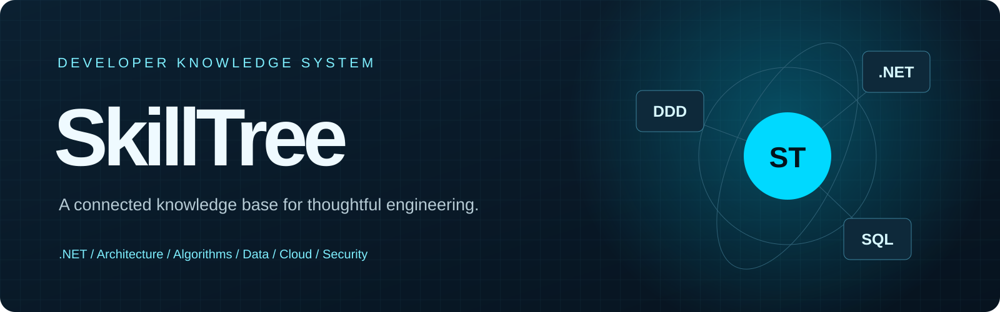

# SkillTree · 极夜知识中枢

<div align="center">


**把零散的工程经验，整理成可以检索、验证和持续演进的知识路径。**

[在线文档](https://dreamwalkerjk.github.io/SkillTree/) · [GitHub 仓库](https://github.com/DreamWalkerJK/SkillTree) · [作者主页](https://github.com/DreamWalkerJK)
</div>

SkillTree 是面向软件开发者的结构化技术知识库，覆盖计算机基础、算法与数学、.NET、架构设计、数据库、云原生、密码学和网络安全。每篇笔记尽量保留问题背景、概念边界、工程取舍与可验证示例。

## 先从任务开始

| 任务 | 推荐入口 |
| --- | --- |
| 写出可靠的 C# / .NET 服务 | [.NET 高阶用法](DotNet/CSharp和NET-LTS中高阶指南.md) · [C# / .NET 专题](DotNet/CSharp专题/README.md) |
| 设计可演进的业务系统 | [DDD](Architecture/DDD.md) · [状态机](Architecture/状态机.md) · [SOLID](DesignPrinciples/SOLID.md) |
| 训练算法与问题建模 | [算法目录](Algorithm/README.md) · [数据结构](Algorithm/数据结构/README.md) · [图论](Algorithm/图论/README.md) |
| 排查数据库瓶颈 | [MySQL](DataBase/MySql/MySQL.md) · [SQL Server 执行计划](<DataBase/SQL Server/SQL Server执行计划.md>) · [CTE 与 View](DataBase/CTE和View.md) |
| 搭建云原生组件 | [Helm Chart](<Component/Helm Chart.md>) · [Kafka 外部地址](Component/kafka配置外部地址.md) · [Nginx](Component/Nginx.md) |
| 建立安全分析能力 | [Kerckhoffs 原则](Cryptography/Kerckhoffs原则.md) · [DDoS 防护](Cybersecurity/分布式拒绝服务攻击.md) · [安全实验](Cybersecurity/Lab/notice.md) |

## 知识导航

- **.NET / C#**：语言特性、运行时、异步与并发、ASP.NET Core、EF Core、Roslyn、.NET 10。
  [专题目录](DotNet/CSharp专题/README.md) · [.NET 10 指南](DotNet/NET10技术学习指南.md) · [Roslyn](DotNet/Roslyn.md)
- **架构与设计**：DDD、状态机、SOLID、设计模式及 .NET 体系结构。
  [架构专题](Architecture/DotNet/README.md) · [设计模式](DesignPattern/设计模式.md)
- **算法与数学**：数据结构、图论、动态规划、组合优化与概率。
  [算法目录](Algorithm/README.md) · [TSP](Algorithm/图与网络/旅行商问题TSP.md) · [生日悖论](Mathematics/生日悖论.md)
- **数据库**：MySQL、PostgreSQL、SQL Server、慢查询与执行计划。
  [MySQL](DataBase/MySql/MySQL.md) · [PostgreSQL](DataBase/PostgreSQL/pssql.md)
- **云原生与组件**：Helm、Kafka、Nginx 以及可部署、可审计的配置实践。
- **密码学与网络安全**：SHA-256、哈希碰撞、DDoS、Kali 与隔离实验。
  [SHA-256](Cryptography/SHA-256.md) · [Kali](Cybersecurity/Tools/Kali.md)
- **计算机基础**：网络模型、Linux / Windows 命令与通用编码技能。
  [网络模型](Network/网络模型.md) · [Linux](OperatingSystem/Linux/操作命令.md) · [Windows](OperatingSystem/Windows/基础命令.md)

## 建议学习路径

1. **建立底座**：阅读 [网络模型](Network/网络模型.md)、[数据结构](Algorithm/数据结构/README.md) 和 [Linux 命令](OperatingSystem/Linux/操作命令.md)。
2. **掌握主力栈**：沿 [C# / .NET 专题](DotNet/CSharp专题/README.md) 学习异步、并发、内存和性能，并运行 [示例项目](DotNet/Examples/CSharpNetLts/README.md)。
3. **提升设计能力**：用 [DDD](Architecture/DDD.md)、[状态机](Architecture/状态机.md) 和 [SOLID](DesignPrinciples/SOLID.md) 复盘真实业务模块。
4. **连接生产环境**：结合 [数据库优化](DataBase/MySql/MySQL.md)、[Helm Chart](<Component/Helm Chart.md>) 和 [云原生 .NET 架构](Architecture/DotNet/构建适用于Azure的云原生.NET应用.md)。
5. **补齐安全视角**：从 [Kerckhoffs 原则](Cryptography/Kerckhoffs原则.md) 到 [DDoS 防护](Cybersecurity/分布式拒绝服务攻击.md)，在隔离的 [Docker 实验环境](Cybersecurity/Lab/notice.md) 中验证。

## 在线文档与本地预览

在线版本由 GitHub Pages 发布：<https://dreamwalkerjk.github.io/SkillTree/>。站点使用 Docsify 渲染 `main` 分支 Markdown，支持侧边栏导航、全文搜索、深浅主题、代码高亮、KaTeX 公式和前后篇阅读。

本地预览无需安装依赖：

```powershell
python -m http.server 8000
```

然后打开 <http://localhost:8000/docs/>，即可直接读取当前工作区内容。

## 仓库结构

```text
Algorithm/ Architecture/ Component/ Cryptography/ Cybersecurity/
DataBase/ DesignPattern/ DesignPrinciples/ DotNet/
GeneralCodingSkills/ Mathematics/ Network/ OperatingSystem/ docs/
```

## 内容维护

1. 将 Markdown 放入对应知识域目录，写清背景、边界、取舍和验证方式。
2. 在 [docs/_sidebar.md](docs/_sidebar.md) 补充导航；核心入口变化时同步更新 [docs/home.md](docs/home.md) 与本 README。
3. 检查相对链接、代码语言标记和移动端排版，并用本地 Docsify 页面实际点击。
4. 提交到 `main` 后等待 GitHub Pages 部署；站点外观与交互维护在 [docs/index.html](docs/index.html)、[styles.css](docs/assets/styles.css) 和 [site.js](docs/assets/site.js)。

内容以学习和工程实践为目的。进行压力测试、扫描或安全实验前，请取得书面授权，并使用隔离资产与预设的停止、监控和回滚方案。

<div align="center">持续整理，持续验证，持续把知识变成可复用的工程判断。</div>
